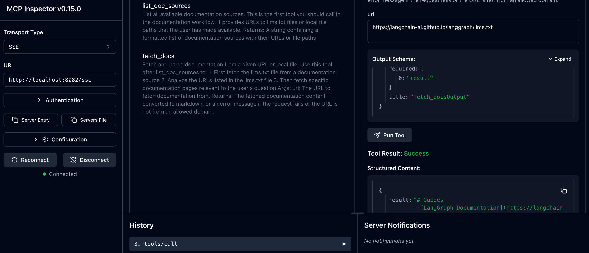

# build-llm-apps-with-langchain

## Project Setup

- using pipenv as package manager
  - pip3 install pipenv
  - pipenv shell
- install dependencies required
  - pipenv install langchain
  - pipenv install langchain-openai (3rd party for openai models)
  - pipenv install langchain-community (open source community helper packages like text-splitters etc)
  - pipenv install langchainhub
- running with the correct python kernel interpreter
  - cmd + shift + p (and go to Python interpreter)
  - select the interpreter that was created during pipenv shell
- set up .env files to hold credentials/api keys
  - from dotenv import load_dotenv (to pass env variables into code)
- set $PYTHONPATH in shell env (bash or zsh) to include the project workdir
  - so that nested modules/packages can be picked up by vscode during runtime

## Notes

- custom developed packages --> need an empty \_\_init\_\_.py
- name of package dir must be in underscore (third_party not third-party)
- it also need to be on the same dir level as the executing py file by default
  - unless a launch.json is customised in vscode to extend the pythonpath or add in settings.json
  - https://k0nze.dev/posts/python-relative-imports-vscode/

## Agents

- use LLM to reason & process tasks
  - Chain Of Thought Reasoning via Prompt Engineering
- LLMs do not have access to external data that it is not trained on -> agents allow us to connect third party services to interact
- langchain tools allow us to convert python functions into tools which we can allow llm to have access to
- note: use raw gist if not will have JSONDECODEERROR

## LangChain Theory

- token limit = input + llm response output

  - exceed token limit due to large context etc
  - Token Limit Handling Strategies (eg summarising documents use case)

    - Stuffing (Pushing all the documents into the prompt as is without any alterations)

      - from langchain.chains.summarize import load_summarize_chain
      - gives a langchain chain that summarize documents
      - chain_type = "stuff"
      - load_summarize_chain(llm, chain_type="stuff")
      - Pro: Most Intuitive and simple
      - Con: will hit token limit once there are many documents
      - Con: the size of payload that we can send to the server that is doing the llm inference apis (even if the llm model do not have a token limit)

    - MapReduce (taking all the documents, each doc will have a new prompt containing the summary instructions and context)

      - from langchain.chains.summarize import load_summarize_chain
      - load_summarize_chain(llm, chain_type="map_reduce")
      - applying a transformation function to a collection and creating a new collection
        - involves a new mapping step which will take the prompts created from the documents and send to the llm
          - each doc-llm call runs parallel (optimize performance)
      - applying a reduction function
        - involves a reduce step to take all the summaries and create a big final summary
          - llm call to an iterable and produce a single final summary
          - langchain handles it we only call the load_summarize_chain
      - Pro: scale to a large number of documents
      - Pro: run parallel (optimize perf & inference time)
      - Con: making a lot of API calls (might be affected by RateLimiters)
      - Con: Cost
      - Con: might lose some information since we summarize each document (lose some context)

    - Refine (applying a binary function to the initial value and first element of the list and and accumulating the value)

      - from langchain.chains.summarize import load_summarize_chain
      - chain = load_summarize_chain(llm, chain_type="refine")
      - take the first summary and second document and combine together
      - get another refined summary
      - take the newly refined summary and third document and combine together
      - keep refining till we end up with a final perfect summary
      - implemented by LangChain

- Memory Management
  - Co-Reference resolution
    - task of identifying all expressions, words or phrases in a text that refer to the same entity or concept
    - idea of state & chat history
    - passing the prompt to the llm some data or info that helps the LLm to make co-reference resolution
    - if 1 hr long convo --> too much data into prompt --> exceed token limit
    - https://python.langchain.com/docs/how_to/chatbots_memory/
  - how LangChain handles
    - Stuffing prev msgs into LLM prompt
    - Stuff but trim old messages to reduct the amount of distracting info that the LLM has to deal with
      - from langchain_core.messages import trim_messages
      - trimmer = trim_messages(strategy="last", max_tokens=2, token_counter=len)
      - trimmer.invoke(state["messages"]) --> call the trimmer to trim messages
    - More complex modifications like synthesizing summaries for long running convos
      - using a summary prompt --> summary the raw messages --> pass the summarised messages to the CheckPointer to persist and pass to LLM prompt
    - using LangGraph CheckPointer class to persist messages to a DB
    - CheckPointing --> every iteration LangGraph will persist it in a DB or inMemory
      - eg from langgraph.checkpoint.memory import MemorySaver (in memory)
      - got other types for PostgreSQL, MySQL, Redis, Mongo etc

## MCP Servers

- MCPdoc from langchain (https://github.com/langchain-ai/mcpdoc)
  - retrieve latest documentations from langchain website
- npx @modelcontextprotocol/inspector
  - to test MCP server functionality (ensure the proxy token is copied when MCP Inspector is ran)
    
- MCP Client
  - Invoke Tools
  - Queries for Resources
  - Interpolates Prompts
- MCP Server
  - Exposes Tools
  - Exposes Resources
  - Exposures Prompts
- Tools (Model Controlled)
  - Functions invoked by the LLM (eg. Search/Retrieve, Send Msg, Update DB)
- Resources (Application Controlled)
  - Data exposed to the application (eg. Files, DB Records, API Responses)
- Prompts (User Controlled)
  - Pre-defined templates for AI Interactions (eg. Doc Q&A, Transcript Summary, JSON Output)
- LangChain's bind_tools
  - Tools bind to LLM
- MCP
  - Tools bind to AI Apps (eg Cursor, windsurf, Claude Desktop, LangGraph Agent etc)
  - MCP Clients are the one who are injecting the instructions of the tools that we need to invoke to the LLM layer
- LangChain's MCP Adapter (https://github.com/langchain-ai/langchain-mcp-adapters)
  - enable seamless integration of MCP tools with LangChain & LangGraph
  - tools capabilitity
- to run mcp servers
  - uv run server_file.py
- Ollama Models not all support tool calling
  - mistral & llama 3.1 supported

## LangGraph

- Agentic software as state machine
  - concepts of nodes & edges in the graph
  - cycles
  - state (shared across nodes & edges)
- Core Pillars
  - Controllability
  - Persistence
  - Human-in-the-loop
  - Streaming
- Opinionated
  - offers a lot of building blocks
    - running nodes in parallel
    - conditional branching with LLMs
    - persistence built in
    - implement human-in-the-loop flow easily to integrate human feedback
    - time travelling which is to replay some step that did not work correctly
      - make debugging and tracing easier (LangSmith)
- Core Components
  - Nodes
    - Essentially Python Functions (special function)
    - always take in the current GraphState & returns a dictionary {}
    - Every Node will update the state
    - Full Flexibility of what you want to do inside the nodes
    - Start Node
      - the entry point for graph execution
    - End Node
      - the last execution node
    - Both the start node & end node are no operation nodes
  - Edges
    - Connect those nodes within the graph execution
  - Conditional Edges
    - Help to make decision (filtering to go which node next)
  - Agent State
    - dictionary that contains the information to track the graph, node execution results, temp results or chat history
    - local to the graph ie available for every node to access within the graph execution
    - can also be persisted into persistent storage (eg continue from previous stopped flow point)
- Cyclic Graph
- Human in the Loop (to get human feedback for conditional edges)
- Persistence
